# Learningm
> Learningm is a language learning app designed to learn Indian languages, current scope of this app is limited to Kannada only
> The project was done as Academic mini project.
> For front end I have used React-native(expo) and for back end springboot (which is not done my me someone else).
> Along with React-native I have used Redux saga for state management and async storage ,for ui Reactnative elements .


### Project setup
Befor setting up install ngrok in your system  [download here](https://ngrok.com/download)
or you can download from npm as well [npm link](https://www.npmjs.com/package/ngrok)

#### for backend 
you can check [here](https://github.com/AishwaryaGits/LearningmApiService.git)
its a springboot application  so you need to download spring boot tools and 
mysql 

#### for frontend

```
git clone https://github.com/Lohith6859/LearningmApp.git
cd Learningm
npm install
npm start
```
go to terminal 
`ngrok http 5000
`
add the ngrok url to ROOT_URL in the environment.js
you can use your mobile or android studio also .

### SCREENSHOTS

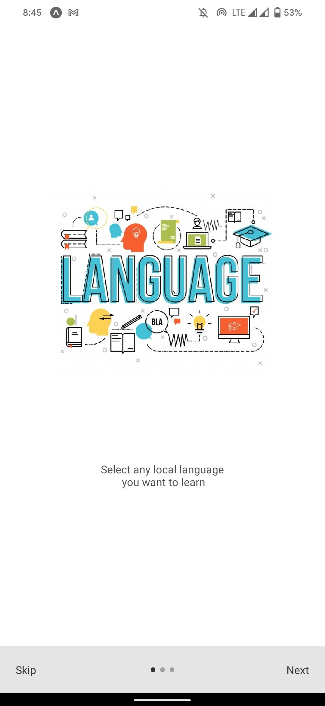 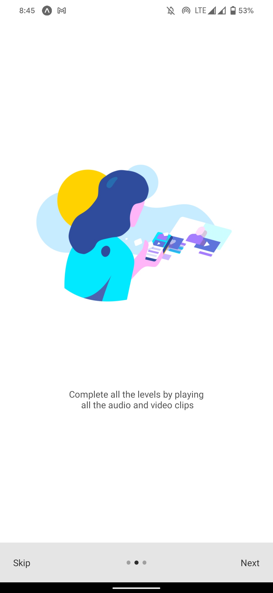 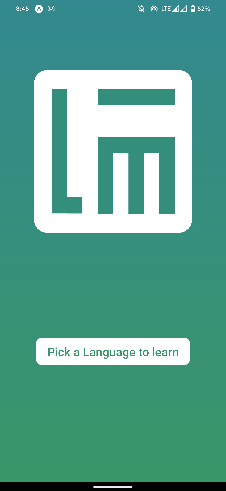 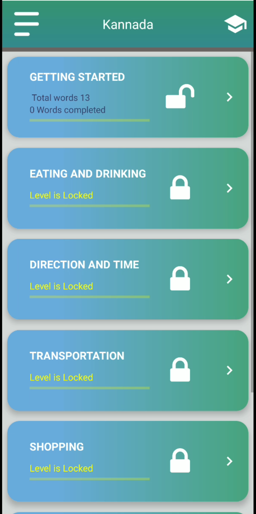 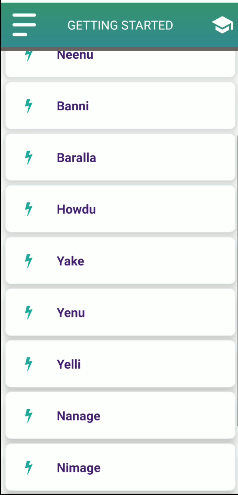 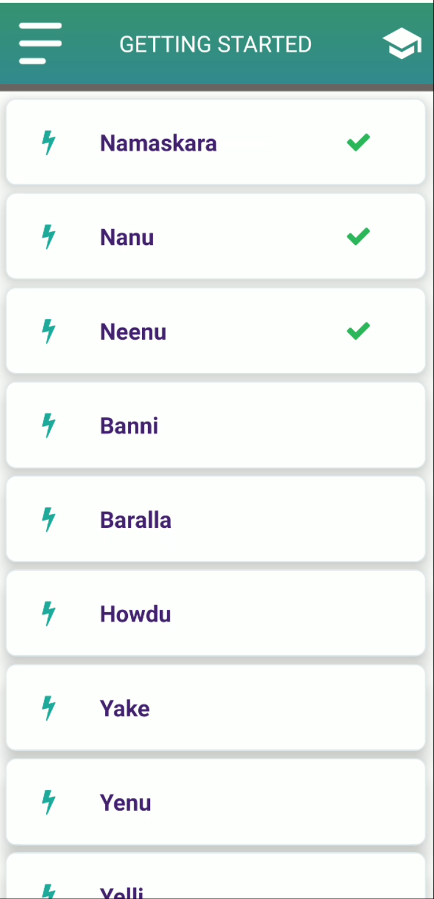 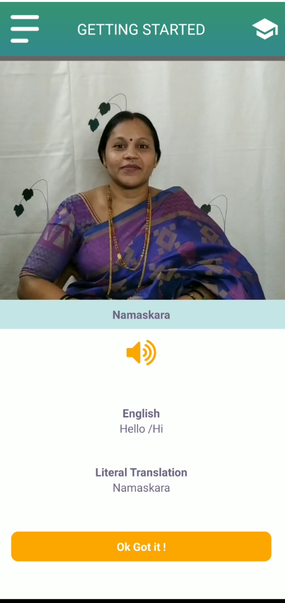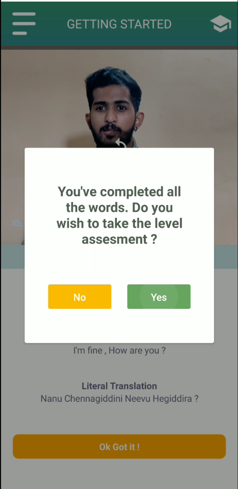 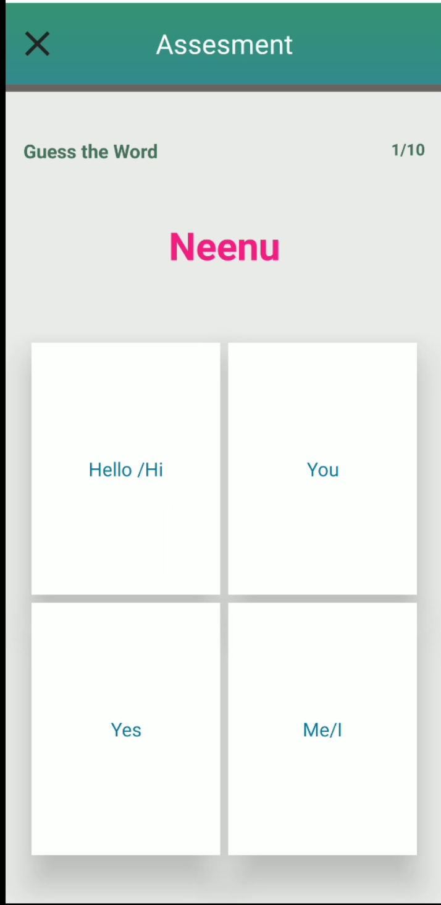 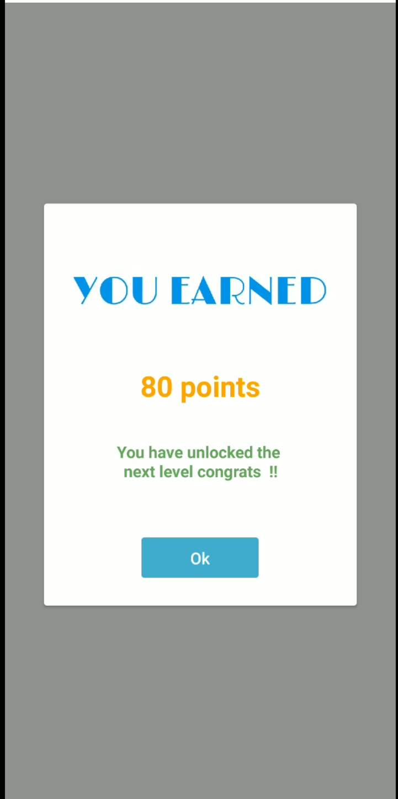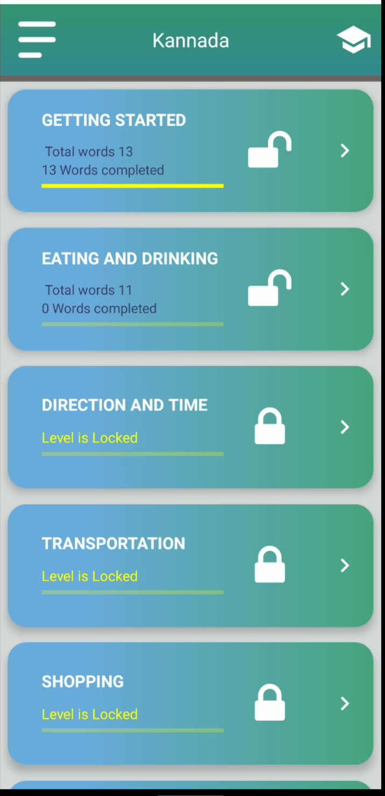 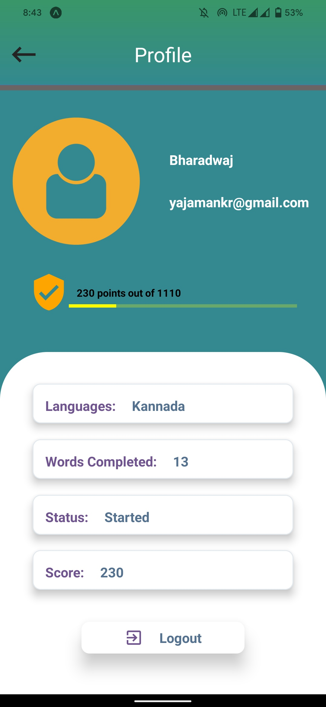 
 
 
 

 
 


 


